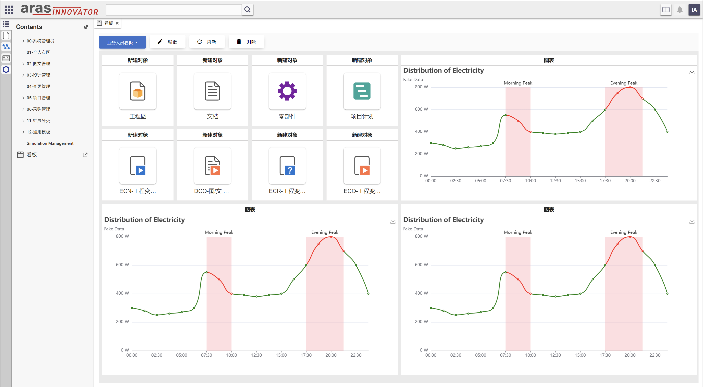
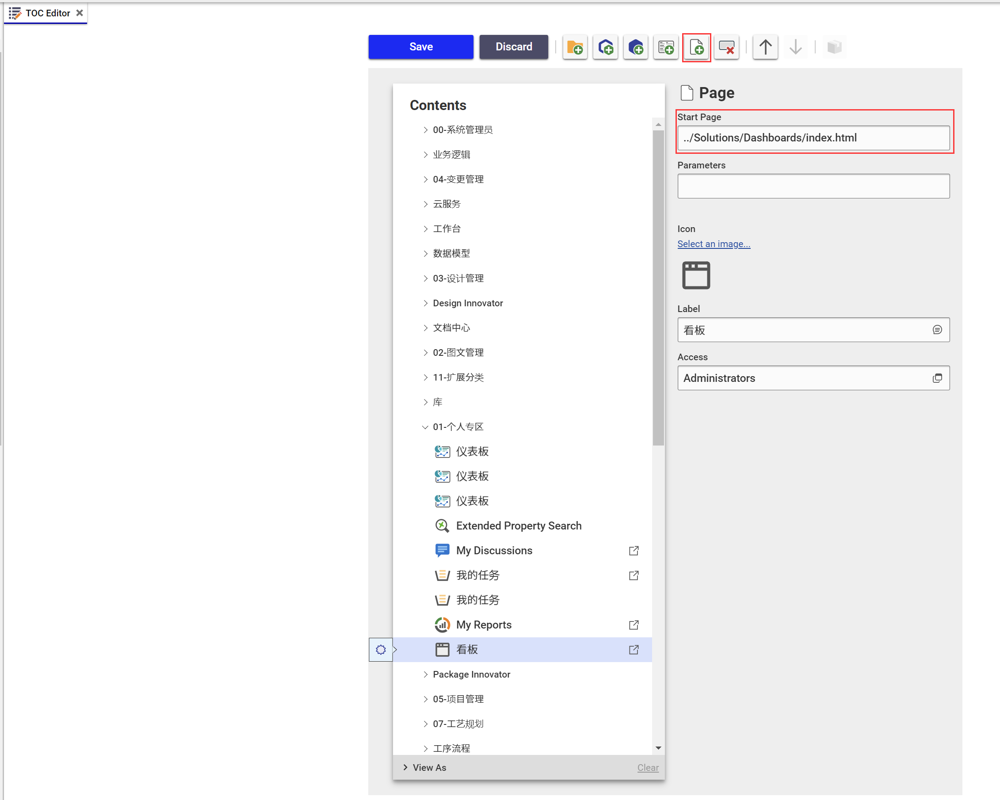
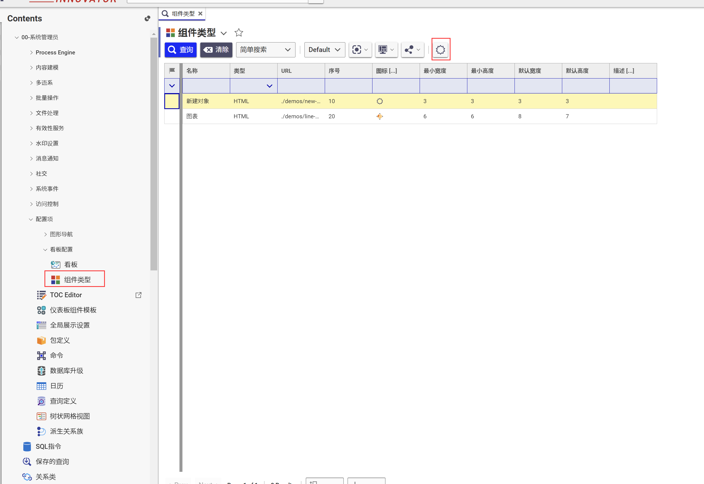

# Aras Innovator 看板

Aras Innovator 看板

## 支持系统版本

理论上应该都支持;不过Aras2023版已经在系统内置有看板了,建议可以在Aras10-Aras2023版本之间使用

## 安装

### 必备条件

1. Aras Innovator 已安装
2. Aras Package Import 导入工具

### Code tree 安装步骤

1. 备份您的CodeTree并存储在安全的地方
2. 打开本地 `..\Dashboards\` 文件夹
3. 复制 `\Innovator\` 文件夹
4. 将其粘贴到安装目录的根目录
    + 默认情况下路径为 `C:\Program Files\Aras\Innovator\`

### Database 安装步骤

1. 备份您的数据库并将BAK文件存储在安全的地方
2. 打开 Aras Package Import 工具
3. 输入Aras Innovator系统地址并点击 **Login**
4. 在弹出的登录页面中输入登录信息
    * 须使用 **root** 用户登录
5. 在 **TargetRelease** 控件中输入**包**的名称(可随意填写,建议填写 `Dashboards`)
    * 可选: 在 **Description** 控件中填写描述信息
6. 在 **Path** 控件中输入本地安装包路径 `..\Dashboards\Imports\imports.mf` 
7. 在 **Available for Import** 控件中勾选 **Dashboards**
8. 选择 Type = **Merge** , Mode = **Thorough Mode**
9. 点击顶部左侧 **Import**
10. 等待导入成功后关闭 Aras Package Import 工具

## 功能配置
1. 使用管理员账户登录Aras
2. 在新版Aras系统中使用`TOC Editor`将看板页面添加至TOC中,旧版系统使用对象类`TOC View`绑定看板页面
    * 看板页面地址`../Solutions/Dashboards/index.html`

3. 可在`系统管理` - `配置项` - `看板配置` - `组件类型` 中添加自定义组件

## 使用
懒得写 😂

## 技术交流 📣
[QQ群:197823386](http://qm.qq.com/cgi-bin/qm/qr?_wv=1027&k=9QBAR-Ra85m9l3GUxCX49rRFPWLs87FG&authKey=kdr98tqLBx2rF5swIO5%2BiKGQRJdLt8DZ5t2sSHY8pWfHhmjAioXEfWJfs4wShNfJ&noverify=0&group_code=197823386)

